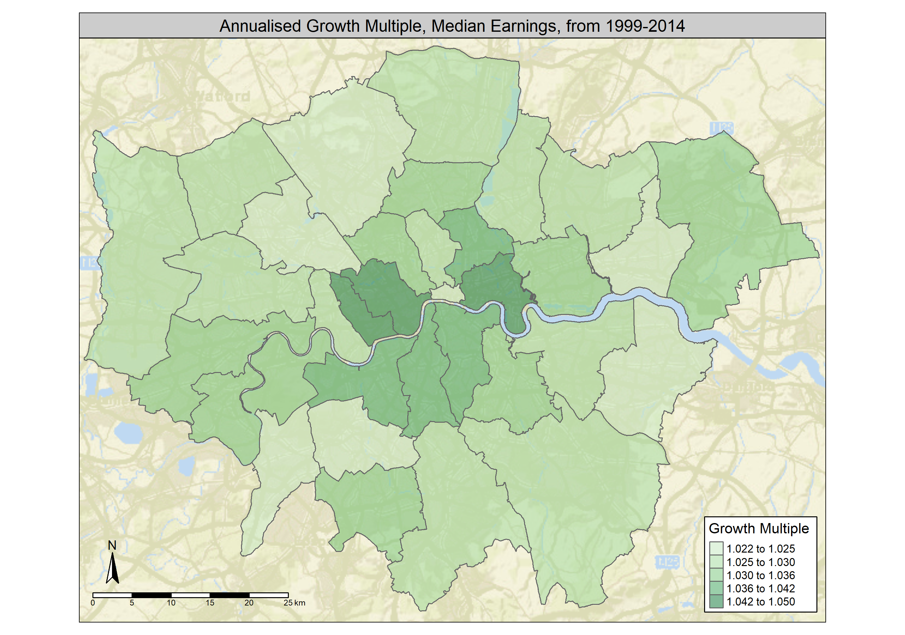

## Introduction 

The aim of this GIS project is to investigate the differences in using R and QGIS as the chosen GIS tool. The data used in this project is timeseries data on median income for tax payers in United Kingdom, from 1999 to 2014. The available data covers individual boroughs in London as well as regional and national areas in United Kingdom.
The conclusion of this project is that each program has its advantage, and so in respect to the question about which one is the better, it depends on the goal of the task. R does a better job on the Data Science related tasks, but QGIS makes it easier to handle the visualization part of the job.

This short project is structured such that it should be clear to see dis-/advantages of each program. 
Below follows a short description of the data, both the raw and processed data that at the end is visualised.
The project rounds of with an in-depth description of the dis-/advantages of both programs.

This GIS project intents to visualise the differences in growth multiples of median earnings between boroughs in London. While it causes divergence peoples living standards, it is also a drag on each individual borough’s propensity to invest in innovation. According to some economists, innovation is the main driver of future growth for economies on advanced growth paths. Furthermore, innovation can take economies from one growth path to another, and therefore should investing in innovation be a priority for all societies. 

The first thing we do is to read in the raw data that contains the median earnings for each borough in London, as well as regional and national regions in United Kingdom.  
```{r include=FALSE}
#To clear the global environment
rm(list=ls())
# Enabling the relevant libraries
x = c("tidyverse",'shinyjs','leaflet','magrittr','reshape2','readxl','dplyr',"maptools","classInt","OpenStreetMap","tmap","RColorBrewer", "sp", "rgeos", "tmaptools","ggmap", "shinyjs","sf", "downloader", "rgdal", "geojsonio")
lapply(x, require, character.only = TRUE)

data_raw <- read_xls('C:/Users/Krist/Desktop/Kristian/Privat/Ansøgninger/Udveksling/University College London/Being there/Geographic Information Systems/First Assignment/income-of-tax-payers.xls')
holder = names(data_raw)
data = data_raw[,1:2]

for (i in seq(3,length(names(data_raw)),3)){
  data = cbind(data, data_raw[,i+2])
}

data = data[2:34,]
```
#### Fig. 1 - Snippet of the raw data
```{r echo=FALSE}
print(data_raw[1:5,1:6])
```

Above can be seen a snippet of the raw data. This is the data from where the average annualized growth multiple is being calculated. It should be obvious from the above snippet, that the data isn't as clean as one could wish, and more important, it is not at all ready to be loaded in to QGIS.

A growth multiple for each year, for each borough, is calculated and can be seen from the snippet below.

```{r include=FALSE}
data_all = data[,]

for (i in seq(3,length(names(data)))){
  names(data)[i] = 1996+i
  names(data_all)[i] = 1996+i
}
names(data)[1] = "Code"
names(data_all)[1] = "Code"
names(data)[2] = "Area"
names(data_all)[2] = "Area"

growth_rates= data[,1:2]

for (i in seq(4,length(names(data)),1)){
  growth_rates = cbind(growth_rates, (as.numeric(data[,i])/as.numeric(data[,i-1])))
  data_all = cbind(data_all, (as.numeric(data_all[,i])/as.numeric(data_all[,i-1])))
  names(growth_rates)[i-1] = 1996+i
  names(data_all)[i+15] = sprintf('GM_ %i',(1996+i))
}

data_all=data_all[complete.cases(data_all),]

growth_rates = cbind(growth_rates, ((as.numeric(data[,18])/as.numeric(data[,3]))^(1/16)))
names(growth_rates)[18] = "Avg._Growth_Rate_in_Earnings"
data_all = cbind(data_all, ((as.numeric(data_all[,18])/as.numeric(data_all[,3]))^(1/16)))
names(data_all)[34] = "Avg._Growth_Rate_in_Earnings"

write.csv(data_all,'Processed_income_data.csv')

```
#### Fig. 2 - Snippet of the processed data
```{r echo=FALSE}
print(growth_rates[1:5,1:6])
```

In this project, we are only interested in the average annualized growth multiple, and it is the one that we plot in the map.
The average growth multiple for each borough is visualized on the map below.

```{r include=FALSE}
#The boundary data can be downloaded from github
BoroughMapSF <- read_shape("C:/Users/Krist/Desktop/Kristian/Privat/Ansøgninger/Udveksling/University College London/Being there/Geographic Information Systems/GIS/Wk2/Boundary data/statistical-gis-boundaries-london/ESRI/London_Borough_Excluding_MHW.shp", as.sf = TRUE)

BoroughDataMap <- append_data(BoroughMapSF,growth_rates, key.shp ="GSS_CODE", key.data = "Code", ignore.duplicates = TRUE)

BoroughDataMap["Area"] <- NULL
```
```{r include=FALSE}
london_osm <- read_osm(BoroughDataMap, type = "esri", zoom = NULL)
m <-qtm(london_osm) + 
      tm_shape(BoroughDataMap) + 
      tm_polygons("Avg._Growth_Rate_in_Earnings", 
                  style="jenks",
                  palette="Greens",
                  midpoint=NA,
                  title=c("Growth Multiple"),
                  alpha = 0.5,
                  legend.position = c("right", "bottom")) + 
      tm_compass(position = c("left", "bottom"),type = "arrow") + 
      tm_scale_bar(position = c("left", "bottom")) +
      tm_layout(legend.position = c("right","bottom"),legend.frame = T) +
      tm_layout(panel.show = TRUE, panel.labels = "Annualised Growth Multiple, Median Earnings, from 1999-2014", panel.label.size = 1.05)
tmap_save(m,"Annualised Growth Multiple.png", width=2820, height=1980)

```
#### Fig. 3 - Map created in R


#### Fig. 4 - Map created in QGIS


Below is the coming description of the dis-/advantages of each program.